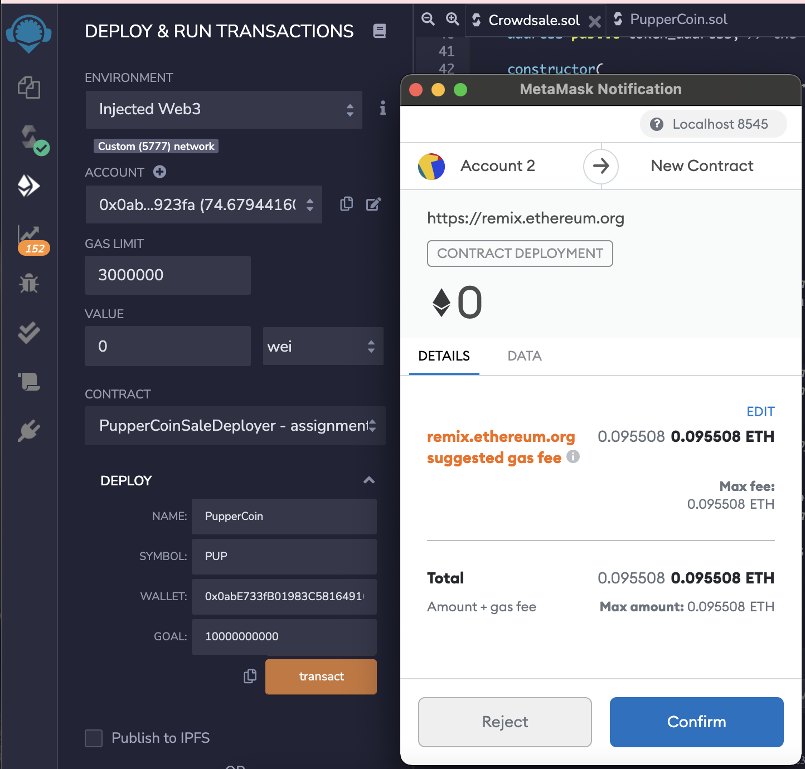
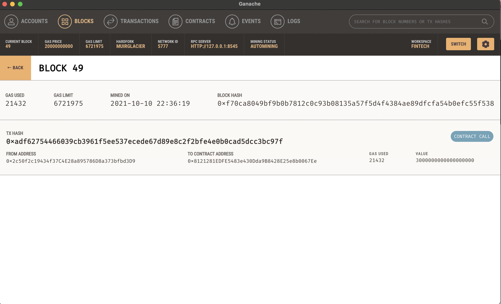

# Crowdsale in Solidity - PupperCoin

## Background

Your company has decided to crowdsale their PupperCoin token in order to help fund the network development.
This network will be used to track dog breeding activity across the globe in a decentralized way, and allow humans to track the genetic trail of their pets. You have already worked with the necessary legal bodies and obtained the green light on creating a crowdsale open to the public. However, you are required to enable refunds if the crowdsale is successful and the goal is met, and you are only allowed to raise a maximum of 300 ether. The crowdsale will run for 24 weeks.

Crowdsale will be deployed using Ganache wallet and local testnet on MetaMask. It will then redeployed to Kovan testnet by switching MetaMask to Kovan testnets. When deploying to a network,since Kovan faucets only provide small portion of test ether, we will reduce the goal when deploying to a testnet to an amount much smaller, like 10,000 wei.

ERC20 token will be created and minted through a `Crowdsale` contract that can leverage from the OpenZeppelin Solidity library.

This crowdsale contract will manage the entire process, allowing users to send ETH and get back PUP (PupperCoin).
This contract will mint the tokens automatically and distribute them to buyers in one transaction.

Below OpenZepplein contracts will be inherited to bootstrap the crowdsale contract. 

 * `Crowdsale` 
 * `CappedCrowdsale` 
 * `TimedCrowdsale` 
 * `RefundableCrowdsale`
 * `MintedCrowdsale`

## Instructions

To start with, two files will be created on Solidity.
1. Crowdsale.sol
2. PupperCoin.sol 

Go through the codes and compile Crowdsale.sol and PupperCoin.sol. 

Deploy PupperCoinSaleDeployer contract from the dropdown menu. Fill in palameters name, symbol, wallet and goal. Name "PupperCoin", Symbol "PUP", wallet Metamask address 1 and set goal to 10000000000.

Click transact and press confirm button on Metamask popup. Take note of the token_address.

Confirm contract and new block creation on Ganache. 

Next deploy PupperCoin contract and input 'Name', 'Symbol' and 'Initial_supply' accordingly.

Switch to Crowdsale contract and in Address tab input token_address and deploy. 

Transaction note and block creation on Ganache.

## Testing on Kovan net

Now switch to Kovan Test Network on Metamask.
Deploy PupperCoinSaleDeployer and fill in parameters accordingly. Make sure that the environment is Kovan Test Network on Remix as well. 

Click transaction and hit confirm botton on Metamask. If sucessful, transaction of contract creation can be confirmed on Etherscan.  

Next deploy Crowdsales contract and test transaction using another account. 

The transaction has been completed successfully.

